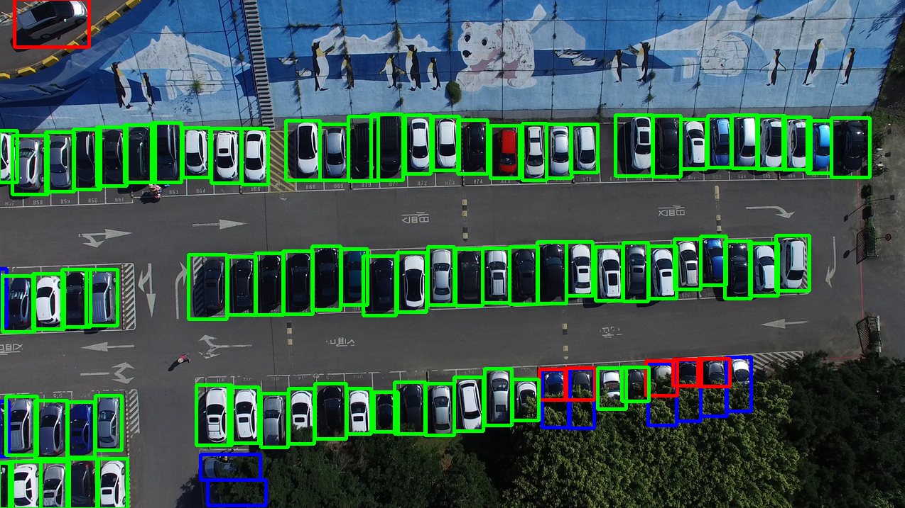

## <div align="center">DSORT-MCU: Detecting Small Objects in Real Time on MCUs</div>


## <div align="center">Install Ultralytics</div>

Pip install the ultralytics package including all [requirements](https://github.com/ultralytics/ultralytics/blob/main/requirements.txt) in a [**Python>=3.8**](https://www.python.org/) environment with [**PyTorch>=1.7**](https://pytorch.org/get-started/locally/).

[](https://badge.fury.io/py/ultralytics) [](https://pepy.tech/project/ultralytics)

```bash
pip install ultralytics
pip install wandb
```

For alternative installation methods including Conda, Docker, and Git, please refer to the [Quickstart Guide](https://docs.ultralytics.com/quickstart).


## <div align="center">Models</div>

TinysissimoYOLOv1.3 detection models trained with different target NBA values for the tiling are available here.

| Model                                                                                                            | Target NBA <br>[%] | Avg #Tiles | size <br>(pixels) | mAP<sup>test</sup> <br>50 | mAP<sup>test</sup> <br>50-95 | MAE  |
|------------------------------------------------------------------------------------------------------------------|--------------------|------------|-------------------|---------------------------|------------------------------|------|
| [TinysissimoYOLO_0.02](https://github.com/mojulian/ultralytics/releases/download/0.1/TinyissimoYOLO_nba_0_02.pt) | 2                  | 10.1       | 256               | 92                        | 62.5                         | 21.2 |
| [TinysissimoYOLO_0.04](https://github.com/mojulian/ultralytics/releases/download/0.1/TinyissimoYOLO_nba_0_04.pt) | 4                  | 21.6       | 256               | 93                        | 67.5                         | 6.2  |
| [TinysissimoYOLO_0.06](https://github.com/mojulian/ultralytics/releases/download/0.1/TinyissimoYOLO_nba_0_06.pt) | 6                  | 27.8       | 256               | 90                        | 64.0                         | 6.5  |
| [TinysissimoYOLO_0.08](https://github.com/mojulian/ultralytics/releases/download/0.1/TinyissimoYOLO_nba_0_08.pt) | 8                  | 31.3       | 256               | 89                        | 62.5                         | 7.4  |

- **mAP<sup>test</sup>** values are for single-model on [CARPK](https://lafi.github.io/LPN/) dataset.
  <br>Image splits for [train](https://github.com/mojulian/ultralytics/releases/download/0.1/train_images.txt), [val](https://github.com/mojulian/ultralytics/releases/download/0.1/val_images.txt) and [test](https://github.com/mojulian/ultralytics/releases/download/0.1/test.txt) splits are defined in the corresponding links.


## <div align="center">Train Models</div>

Adjust the paths and parameters of the tiling algorithm to your liking in the [tiling config](tiling_config.yaml).
To start training just call the training [script](train_julian.py):

```bash
python train_with_tiling.py
```

## <div align="center">Evaluate Models</div>

Models can be evaluated by calling
```bash
python eval_on_tiled_images.py --plot=False --image-set='test'
```

Setting the `plot` flag to true when calling [eval_on_tiled_images.py](eval_on_tiled_images.py) will plot the predictions as shown in the axample below:



- **Green bboxes**: True positive predictions made by the network
- **Red bboxes**: False positive predictions made by the network
- **Blue bboxes**: Ground truth bboxes of false negative predictions made by the network


## 📜 Paper

[DSORT-MCU: Detecting Small Objects in Real Time on MCUs](https://ieeexplore.ieee.org/stamp/stamp.jsp?tp=&arnumber=10600127)

 Liam Boyle <sup>1</sup>,
 Julian Moosmann<sup>1</sup>,
 Nicolas Baumann <sup>1</sup>, 
 Seonyeong Heo<sup>2</sup> ,
 Michele Magno<sup>1</sup>  <br>

<sup>1</sup> ETH Zurich, Switzerland  
<sup>2</sup> Kyung Hee University, Republic of Korea <br> 

If you find our work useful please consider citing our paper:
```
@ARTICLE{10600127,
  author={Boyle, Liam and Moosmann, Julian and Baumann, Nicolas and Heo, Seonyeong and Magno, Michele},
  journal={IEEE Sensors Journal}, 
  title={DSORT-MCU: Detecting Small Objects in Real-Time on Microcontroller Units}, 
  year={2024},
  volume={},
  number={},
  pages={1-1},
  keywords={Accuracy;Feature extraction;Neural networks;Random access memory;Detectors;Computer architecture;Real-time systems;Object Detection;TinyML;IoT;Microcontrollers},
  doi={10.1109/JSEN.2024.3425904}}
  ```